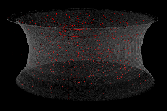

<h1 align="center"> Tomo Scripts for MEALOR II Summer School </h1>
<h2 align="center"> Summer school website: https://mealor2.sciencesconf.org </h2>

  

## Preamble

The data used are extracted from : [A Dataset for In-situ synchrotron tomography experiments to investigate anisotropic damage of line pipe steel](https://zenodo.org/record/3528199#.ZHb2OoTP02w).

    

The analysis is done using the Fiji software, freely availlable here : [https://imagej.net/software/fiji/downloads](https://imagej.net/software/fiji/downloads)

    

