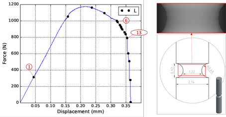

<h1 align="center"> Tomo Scripts for MEALOR II Summer School </h1>
<h2 align="center"> Summer school website: https://mealor2.sciencesconf.org </h2>

  

## Preamble

The data used are extracted from : [A Dataset for In-situ synchrotron tomography experiments to investigate anisotropic damage of line pipe steel](https://zenodo.org/record/3528199#.ZHb2OoTP02w).

    

The analysis is done using the Fiji software, freely availlable here : [https://imagej.net/software/fiji/downloads](https://imagej.net/software/fiji/downloads)

    

During the time of the MEALOR II school, the dataset and some of the scripts used are available to download here : [data tomo](https://eur03.safelinks.protection.outlook.com/?url=https%3A%2F%2Ftransvol.sgsi.ucl.ac.be%2Fdownload.php%3Fid%3De351a905f9a0b442&data=05%7C01%7Caude.simar%40uclouvain.be%7C3c9ea1adf23146ded71608db9cc3250d%7C7ab090d4fa2e4ecfbc7c4127b4d582ec%7C0%7C0%7C638276134176776463%7CUnknown%7CTWFpbGZsb3d8eyJWIjoiMC4wLjAwMDAiLCJQIjoiV2luMzIiLCJBTiI6Ik1haWwiLCJXVCI6Mn0%3D%7C3000%7C%7C%7C&sdata=8LUzWFdov6vuIhM4iuvEaacjUH6wfCnGcYWDD9T%2F%2B8o%3D&reserved=0) (/!\ 3.5Gb)

## The dataset
The data sets used for this exercise session are related to the paper "On the origin of the anisotropic damage of X100 line pipe steel, Part I: in-situ synchrotron tomography experiments" published by Madi et al. in Integrating Materials and Manufacturing Innovation. We will only use a few scans, but the complete dataset is available here:  [https://zenodo.org/record/3528199#.ZHb2OoTP02w](https://zenodo.org/record/3528199#.ZHb2OoTP02w).

In this study, the damage evolution of a grade X100 line pipe steel were investigated using in-situ synchrotron-radiation computed tomography (SRCT) of notched round bars (see Fig., right). Three scans (scan 01, scan 06 and scan 13, see Fig. left) will be used, they have been obtained on a specimens loaded along the rolling (L) direction. 

The first scan (scan 01) has been obtained in the early stage of elastic regime, and it will be used as the initial state (i.e. the minor εel is neglected). Scan 06 and scan 13 were obtained after significant void nucleation/growth and at the onset of the final coalescence stage that triggers catastrophic failure of the specimen, respectively. 